# 0525 Vue.js 기초

> Vue 공식문서
>
> https://kr.vuejs.org/v2/guide/index.html


### 1. Vue.js intro

#### (1) What

##### ① Front-End Framework

: 사용자 UI

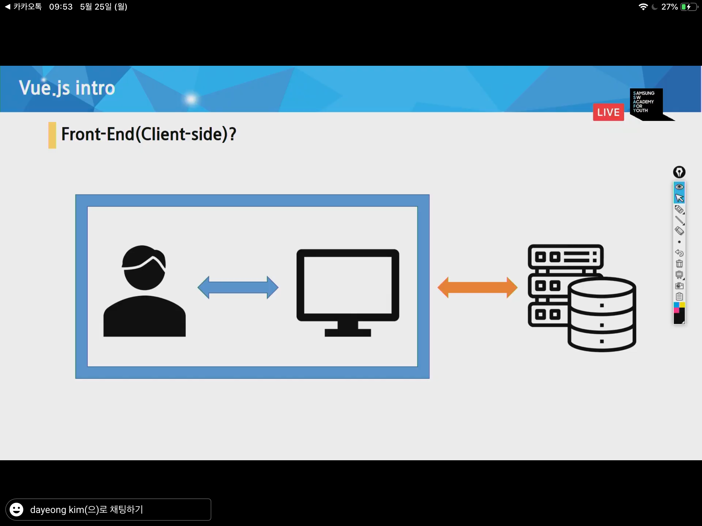


##### ② SPA(Single Page Application) 제작

- 기존

  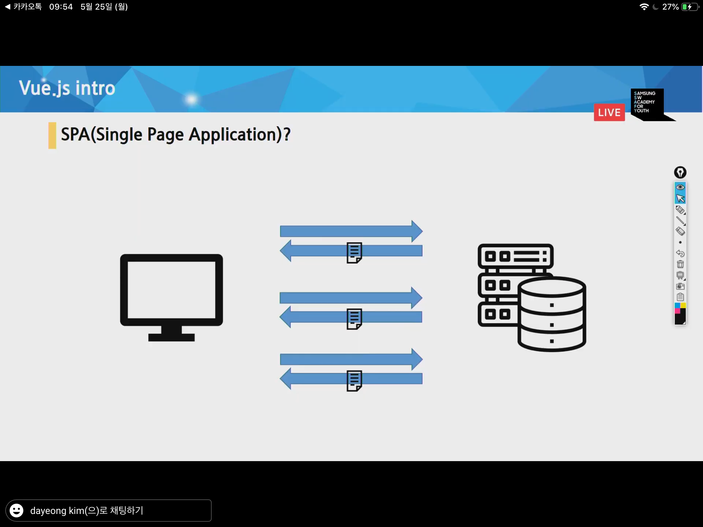


- Vue

  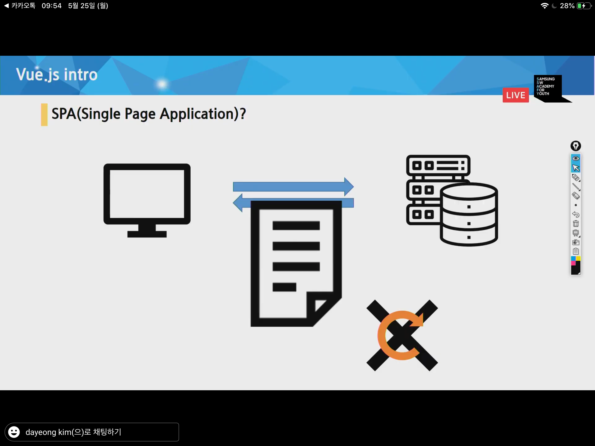

: 문서 한장을 만든다

- 단점 : 상대적으로 로딩속도가 오래걸림 (1회차에 받아야 하는 양이 많아서)

##### ③ Client-side rendering

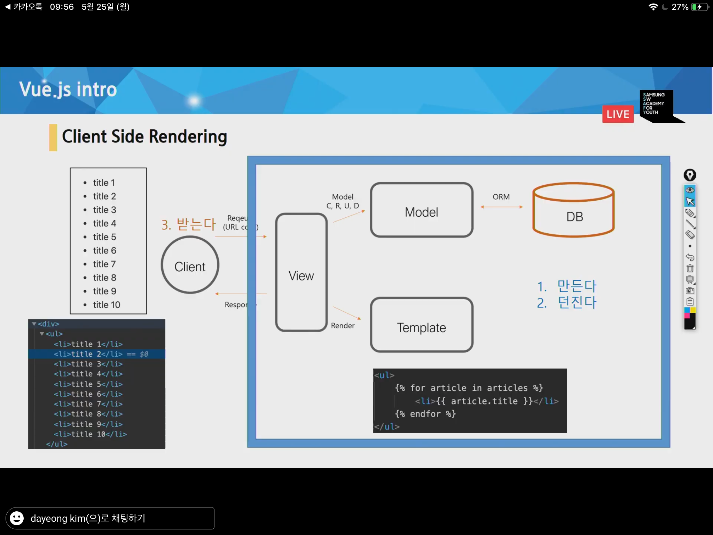

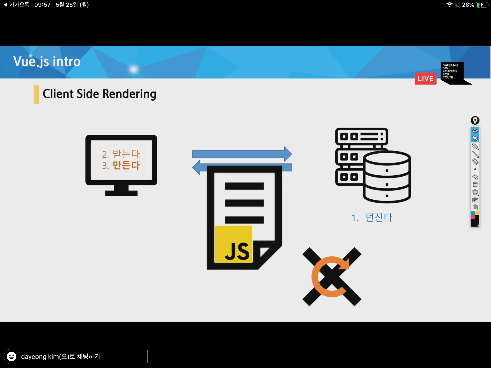

: JS코드가 뭉탱이로 가면 브라우저가 열심히 일을 해서 HTML을 만든다.

- 서버가 텍스트 뭉치를 보내면 브라우저가 받아서 만든다


##### ④ MVVM패턴 (Model View ViewModel)

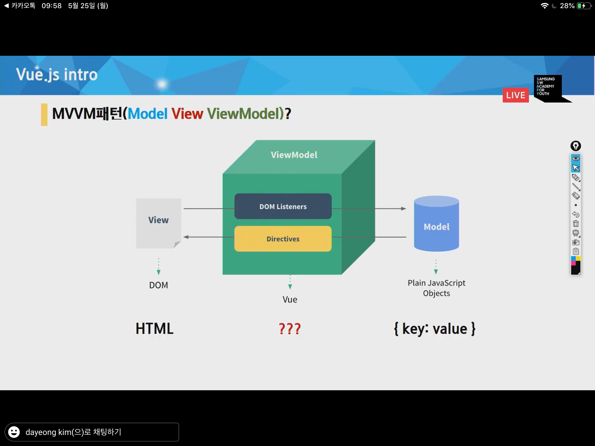


##### ⑤ Reactive(반응형의) / Declarative(선언형의)

- Vue vs React

  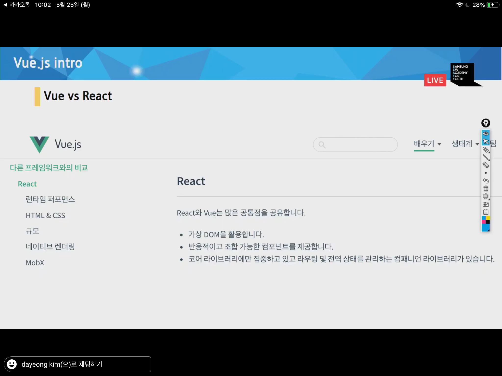


#### (2) Why

##### ① 배우기 쉽다.

##### ② $ (경제적)

##### ③ UX 향상

##### ④ 프레임워크(프렌차이즈)의 장점 (DX향상 - 개발자경험 향상)

- No etc, 선택과 집중
- 유지/보수 용이
- 커뮤니티와 라이브러리


#### (3) How

### 초기설정

> - VS
>   
> - Vetur
>   
> - chrome
>
>   -  Vue.js devtools
>   
> - vue js cdn
>
>   `<script src="https://cdn.jsdelivr.net/npm/vue/dist/vue.js"></script>`


- bash

```bash
$ mkdir 01_vue-intro

$ cd 01_vue-intro

$ touch 00_el.html
$ touch 01_data.html
$ touch 02_interpolation.html
$ touch 03_v-text.html
$ touch 04_v-if.html
$ touch 05_v-if-elseif-else.html
$ touch 06_v-for.html
$ touch 07_v-bind.html
$ touch 08_methods.html
$ touch 09_v-on.html
$ touch 10_v-model.html
$ touch 11_v-show.html

$ touch lucky.html # 로또
```


### - 00_el.html


  > ✅ 기본 구조 잡기 (django의 startproject같은 느낌)

  ```html
  <body>
    <!-- 2. -->
    <div id="app">
  
    </div>
  
    <!-- 1. cdn 작성 -->
    <script src="https://cdn.jsdelivr.net/npm/vue/dist/vue.js"></script>
  
    <script>
      // 3.
      // el은 Vue 인스턴스의 속성이다.
      const app = new Vue({
        el: '#app',
      })
  
      console.log(app)
      console.log(app.$el)
    </script>
  </body>
  </html>
  ```

  

### - 01_data.html


  > ✅ data 정의
  >
  > data : ⭐⭐ MVVM에서 Model이다 !! 
  >
  > - data는 항상 dict형태로 들어간다.

  ```html
  <body>
    <div id="app">
  
    </div>
  
    <script src="https://cdn.jsdelivr.net/npm/vue/dist/vue.js"></script>
    <script>
      const app = new Vue({
        el: '#app', // el : 어떤 요소에 붙일지(mount)를 결정하는 구간
        // ✅ data 정의
        data: { // ⭐⭐ MVVM에서 Model이다 !! 
          message: 'Hello Vue',
        }
      })
    </script>
  </body>
  ```


### - 02_interpolation.html

  > ✅ `{{ }}`

  ```html
  <div id="app">
      {{ message }}
  </div>
  ```


### - 03_v-text.html

  > ✅ v-text와 interpolation은 완전히 같다.
  >
  > : Vanilla JS.에서는 domElement.innerText 속성과 같다.

  - `v-` 접두사로 시작하는 것들은 모두 디렉티브(vue에 명령하는 것)라고 부른다.

  ```html
  <body>
    <div id="app">
      <p v-text="message"></p>
      <p>{{ message }}</p>
    </div>
  
    <script src="https://cdn.jsdelivr.net/npm/vue/dist/vue.js"></script>
    <script>
      const app = new Vue({
        el: '#app',
        data: { 
          message: 'Hello Vue',
        }
      })
    </script>
  </body>
  ```

  

### - 04_v-if.html

  > ✅ v-if의 값이 참이면 browser에 출력, 아니면 출력되지 않음
  >
  > - 판단 기준은 JS 이다.

  ```html
  <body>
    <div id="app">
      <p v-if="bool1">
        true
      </p>
      <p v-if="bool2">
        false
      </p>
  
      <p v-if="str1">
        'Yes'
      </p>
      <p v-if="bool2">
        ''
      </p>
  
      <p v-if="num1">
        1
      </p>
      <p v-if="num2">
        0
      </p>
  
      <p v-if="lst1">
        [1,2,3]
      </p>
      <p v-if="lst2">
        [] => js는 빈 배열이 true 평가
      </p>
      <p v-if="lst1.length">
        [].length를 통해 0인지를 확인
      </p>
  
      <p v-if="obj1">
        {a:1}
      </p>
      <p v-if="obj2">
        {}
      </p>
    </div>
  
    <script src="https://cdn.jsdelivr.net/npm/vue/dist/vue.js"></script>
    <script>
      const app = new Vue({
        el: '#app', 
        data: { 
          // 1.
          bool1: true,
          bool2: false,
          str1: 'Yes',
          str2: '', //빈 str
          num1: 1,
          num2: 0,
          lst1: [1,2],
          lst2: [],
          obj1: {a:1},
          obj2: {},
        }
      })
    </script>
  </body>
  ```

  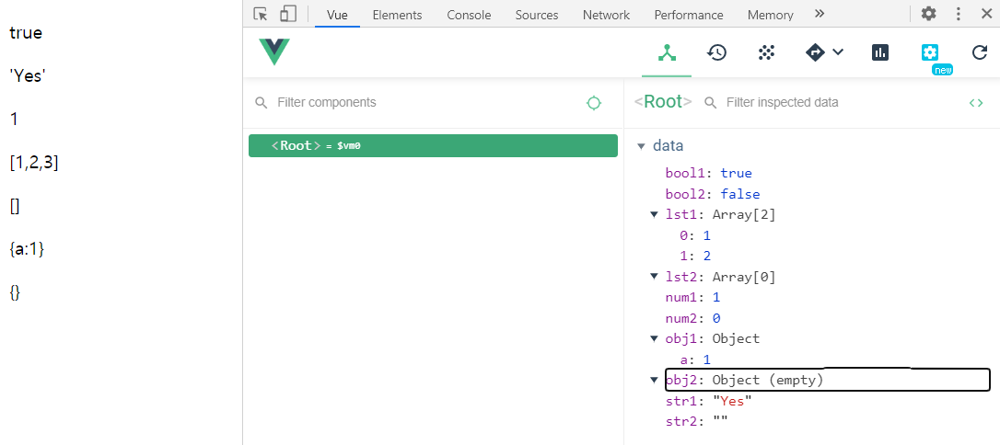

  

### - 05_v-if-elseif-else.html

  > ✅  v-if-elseif-else

  ```html
  <body>
    <div id="app">
      <!-- 2. 평가식 -->
      <p v-if="username === 'master'">
        Hello Master
      </p>
      <p v-else>
        Hello User
      </p>
  
      <p v-if="number > 0">
        양수
      </p>
      <p v-else-if="number < 0">
        음수
      </p>
      <p v-else>
        0
      </p>
  
    </div>
  
    <script src="https://cdn.jsdelivr.net/npm/vue/dist/vue.js"></script>
    <script>
      const app = new Vue({
        el: '#app',
        data: {
          // 1. data 초기화
          username: 'master',
          number: 0,
        }
      })
    </script>
  </body>
  ```

  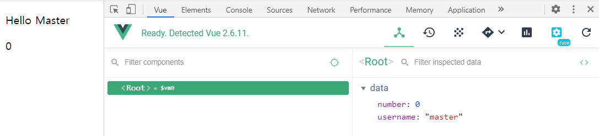

  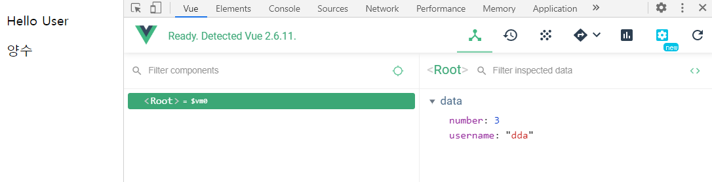


### - 06_v-for.html

  > ✅

  ```html
  <body>
    <div id="app">
      <ul>
        <li v-for="number in numbers">{{ number }}</li>
      </ul>
  
      <ol>
        <li v-for="teacher in teachers">{{ teacher.name }}</li>
      </ol>
    </div>
  
    <script src="https://cdn.jsdelivr.net/npm/vue/dist/vue.js"></script>
    <script>
      const app = new Vue({
        el: '#app',
        data: { 
          numbers: [0, 1, 2, 3, 4, 5],
          teachers: [
            { name: 'neo' },
            { name: 'tak' },
          ]
        }
      })
    </script>
  </body>
  ```

  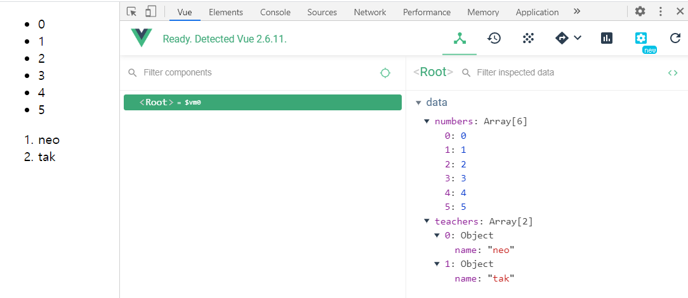

  

### - 07_v-bind.html

  > ✅ `v-bind:표준속성` => 표준 HTML 속성과 Vue 인스턴스를 연동할 때 (+a)
>
  > - shortcut
  >   - `v-bind` 을 줄여서 `:` 으로 쓸 수 있다.

  ```html
  <body>
    <div id="app">
      <a href="{{ googleUrl }}">Bad Google link</a> <!-- 이렇게 쓰면 안됨 -->
  
      <!-- "v-bind:표준속성" => 표준 HTML 속성과 Vue 인스턴스를 연동할 때 (+a) -->
      <a v-bind:href="googleUrl">Good Google link</a>
  
      <!-- `v-bind` 을 줄여서 `:` 으로 쓸 수 있다. -->
      <a :href="naverUrl">Naver link</a>
      
    </div>
  
    <script src="https://cdn.jsdelivr.net/npm/vue/dist/vue.js"></script>
    <script>
      const app = new Vue({
        el: '#app',
        data: { 
          googleUrl:'https://google.com',
          naverUrl: 'https://naver.com',
          randomImageUrl: 'https://picsum.photos/200',
        altText: 'random-img',
        }
    })
    </script>
  </body>
  ```

  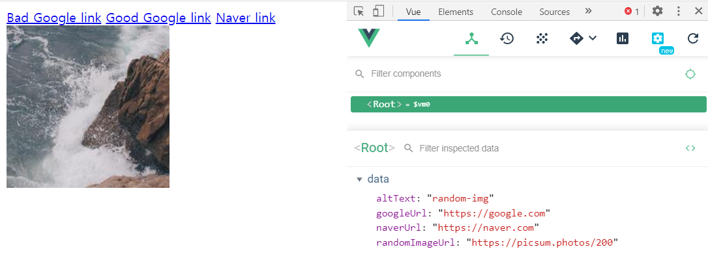

  

### - 08_v-methods.html

```html
<body>
  <div id="app">
    {{ message }}
  </div>

  <script src="https://cdn.jsdelivr.net/npm/vue/dist/vue.js"></script>
  <script>
    const app = new Vue({
      el: '#app',
      data: { 
        message: 'Hello Vue',
      },
      methods: {
        alertWarning: function() {
          alert('WARNING')
        },
        alertMessage (){ //Syntactic Sugar : 위와 아래는 완전히 같습니다.
          alert(this.message)
        },
        changeMessage() {
          this.message = 'CHANGED MESSAGE'
        }
      }
    })
  </script>
</body>
```


### - 09_v-on.html

>  ✅ v-on 사용자 입력 핸들링
>
> : 사용자가 앱과 상호작용 할 수 있게 하기 위해서 v-on 디렉티브를 사용하여 Vue 인스턴스에서 메소드를 호출하는 이벤트 리스너를 추가할 수 있음
>
> - eventListener와 같은 기능
>
> - `v-on:` 을 줄여서 `@` 으로 쓸 수 있다.

```html
<body>
  <!-- ✅ eventListener -->
  <div id="app">
    <h1>{{ message }}</h1>
    <!-- button.addEventListener('click', callbackFunction) -->
    <!-- <button v-on:           click="alertWarning">Alert Warning</button> -->
    <button v-on:click="alertWarning">Alert Warning</button>
    <button v-on:click="alertMessage">Alert Message</button>

    <!-- `v-on:` 을 줄여서 `@` 으로 쓸 수 있다. -->
    <button @click="changeMessage">Change Message</button>

    <hr>

    <input @keyup.enter="onInputChange" type="text">
  </div>

  <script src="https://cdn.jsdelivr.net/npm/vue/dist/vue.js"></script>
  <script>
    const app = new Vue({
      el: '#app',
      data: { 
        message: 'Hello Vue',
      },
      methods: {
        alertWarning: function() {
          alert('WARNING')
        },
        alertMessage (){ //Syntactic Sugar : 위와 아래는 완전히 같습니다.
          alert(this.message)
        },
        changeMessage() {
          this.message = 'CHANGED MESSAGE'
        },
        onInputChange(event) {
          // console.log(event.key)
          // if (event.key == "Enter") {
            this.message = event.target.value
          // }
        }
      }
    })
  </script>
</body>
```

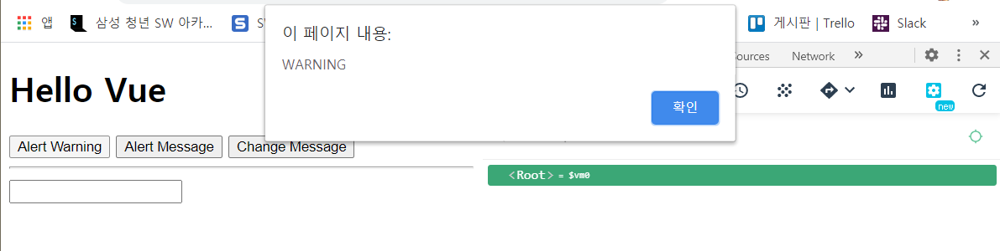

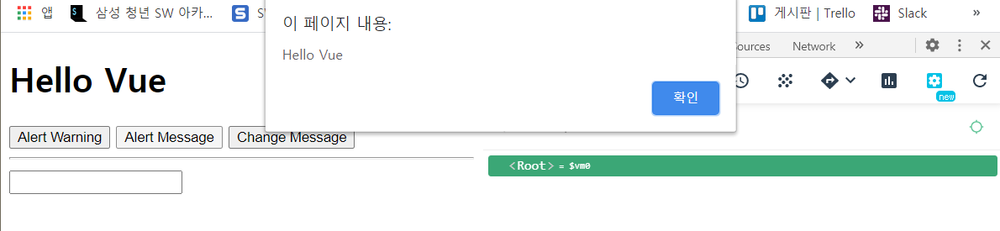

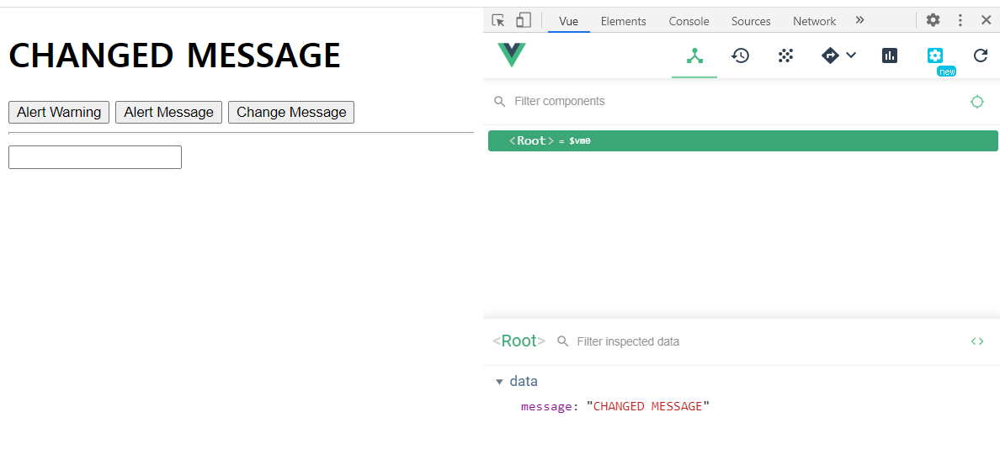

### - 10_v-model.html

> ✅ v-model은 input, select, textarea 에서만 가능하다. => "양방향 바인딩"
>
> 

```html
<body>
  <!-- 2. mount 해 줄 html 대상을 잡아준다. -->
  <div id="app">
    <h1>{{ message }}</h1>

    <!-- v-model 등장 이유 : 사용자 입력과 data를 완전히 동기화 시키고 싶다. ( 사용자 입력 ↔ data) -->

    <!-- ✅ v-model은 input, select, textarea 에서만 가능하다. => "양방향 바인딩" -->
    
    <!-- 단방향 바인딩 (input => data) -->
    1way:
    <input @keyup="onInputChange" type="text">

    <hr>
    
    <!-- 양방향 바인딩 (input <=> data) -->
    2way:
    <input @keyup="onInputChange" type="text" :value="message">

    <br>
    => 이거를 한방에 처리해 줄 수 있게 해준 것이 v-model이다

    <hr>
    <!-- v-model -->
    v-model/2way:
    <input v-model="message" type="text">
    <hr>

  </div>
  
  <!-- 1. CDN  -->
  <script src="https://cdn.jsdelivr.net/npm/vue/dist/vue.js"></script>

  <!-- 3. -->
  <script>
    //  3. 
    const app = new Vue({
      // 3-(1) startproject / 어떤 요소에 mount 해 줄 것인지
      el: '#app' ,
      // 3-(2)
      data: {
        message: 'hi',
      },
      methods: {
        onInputChange(event) {
          this.message = event.target.value
        }
      }

    })
    
  </script>
</body>
```

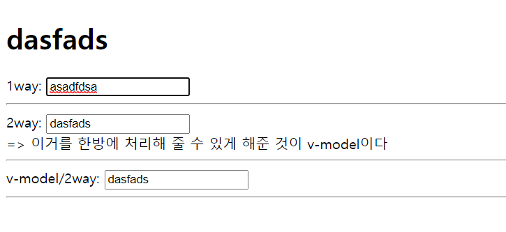


### - 11_v-show.html

> - `v-if` 는 평가(t/f)가 자주 바뀌지 않을 때 유리하다 => 초기 렌더링 cost가 적다. (처음 문서 로딩할 때) 
> - `v-show` 는 평가(t/f)가 자주 바뀔 때 유리하다 => 토글 cost가 적다.
>
> 

```html
<body>
  <div id="app">

    <button @click="changeF">changeF</button>
  
    <!-- v-if 는 평가(t/f)가 자주 바뀌지 않을 때 유리하다 => 초기 렌더링 cost가 적다. (처음 문서 로딩할 때) -->
    <p v-if="t">
        This is v-if with true
    </p>

    <p v-if="f">
      This is v-if with false
    </p>

    <!-- v-show 는 평가(t/f)가 자주 바뀔 때 유리하다 => 토글 cost가 적다.-->

    <p v-show="t">
      This is v-show with true
    </p>

    <p v-show="f">
      This is v-show with false
    </p>

  </div>

  <script src="https://cdn.jsdelivr.net/npm/vue/dist/vue.js"></script>
  <script>
    const app = new Vue({
      el: '#app',
      data: {
        t: true,
        f: false,
      },
      methods: {
        changeF() {
          this.f = !this.f
        }
      }
    })

  </script>
</body>
```

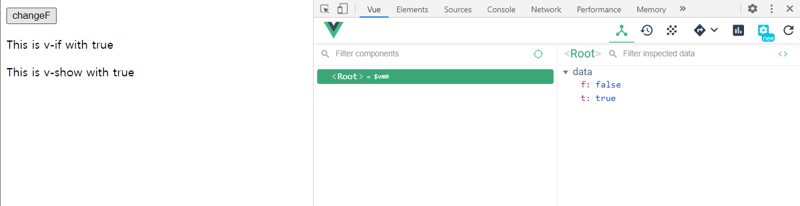

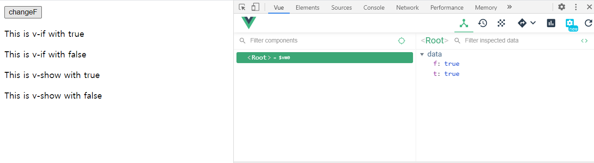


### - lucky.html

```html
<body>
  <div id="app">
    <button @click="getLuckySix">GET LUCKY 6</button>

    <ul>
      <li v-for="number in myNumbers">
        {{ number }}
      </li>
    </ul>
  </div>

  <!-- lodash cdn :  https://cdnjs.com/libraries/lodash.js/-->
  <script src="https://cdnjs.cloudflare.com/ajax/libs/lodash.js/4.17.15/lodash.min.js"></script>
  <script src="https://cdn.jsdelivr.net/npm/vue/dist/vue.js"></script>

  <script>
    const app = new Vue({
      el: '#app',
      data: {
        // [1,,45]에서 6개를 "랜덤"하게 뽑는다.
        // allNumbers: [],
        allNumbers: _.range(1, 46),
        myNumbers: []
      },
      methods: {
      // lodash 사용 안하면 allNumbers를 위한 methods 만들어 줘야했음.
      //   makeAllNumbers () {
      //     for (let i=0; i<45; i++){
      //       this.allNumbers.push(i+1)
          // }
          getLuckySix() {
            this.myNumbers = _.sampleSize(this.allNumbers, 6)
            this.myNumbers.sort((a,b)=> a-b)
            // : JS의 sort는 앞글자만 반영되어 sort가 된다. (이유: 내부적으로 str 처리를 해버리기 때문)
            //  그걸 해결하기 위해서 (a,b)=> a-b 를 넣어줌
            // 아래는 같은 의미의 코드이다. 
            // this.myNumbers.sort(function(a,b){
            //   return a - b
            // })

          }

        }
    })
  </script>

  <!-- 핵심 : 서버가 없이도 로또 번호 추첨 가능 ㅋㅎ
  왜냐면 브라우저가 돌리기 때문이다 !! -->
</body>
```

